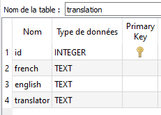

# TranslateDB
Translation in a sqlite db.

Changing the db system only require to change the implementation of `DBHelper` in `dbHelper.py`.

One can generates a db example by uncommenting the line `self.create_test_db()` in the constructor of `DBHelper`

All can be run and parametrized from `usage.py` 

Structure of expected db:

